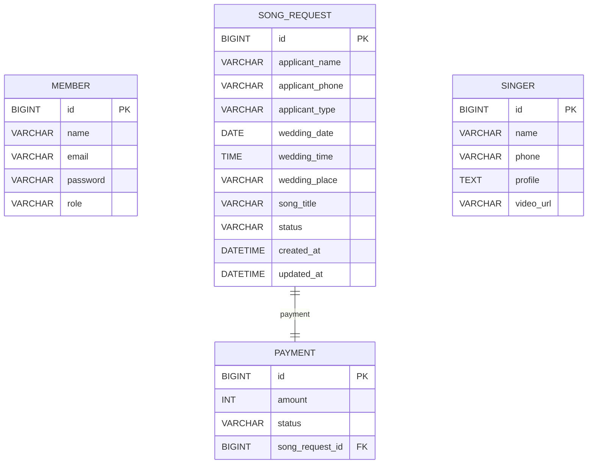
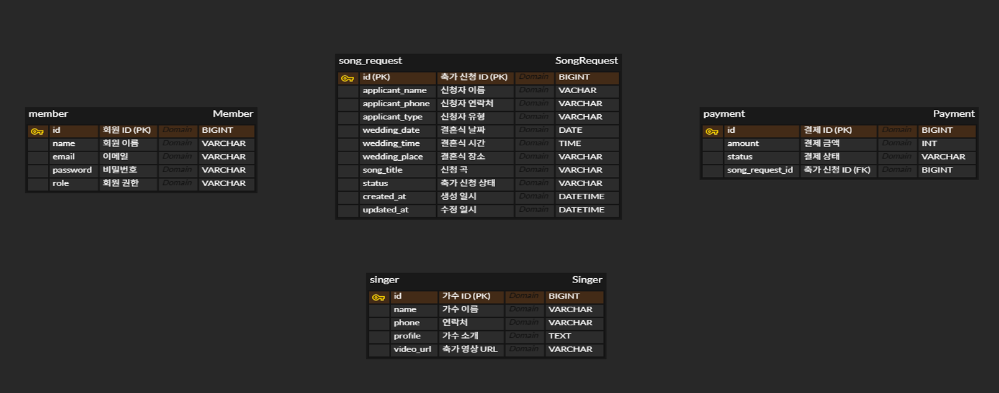

# 🎵 Wisdom Wedding Songs

> 결혼식 축가 예약, 결제, 관리자 상태 관리를 지원하는 웨딩 축가 예약 서비스

---

## 📌 프로젝트 소개

**Wisdom Wedding Songs**는 결혼식 축가 예약을 위한 웹 서비스입니다.

사용자는 원하는 예식 날짜, 시간, 장소, 신청곡 정보를 입력하여 축가를 신청할 수 있으며, 회원가입 및 로그인 후 마이페이지에서 본인의 신청 내역과 진행 상태를 확인할 수 있습니다.

관리자는 관리자 페이지에서 전체 축가 신청 내역을 조회하고, 신청 상태를 승인, 거절, 축가 완료 상태로 변경할 수 있습니다.

또한 **PortOne V2 결제 시스템**을 연동하여 실제 서비스와 유사한 결제 흐름을 구현하였고, 파일 업로드 기능을 통해 가수 소개 페이지에서 실제 축가 공연 영상을 확인할 수 있도록 구성하였습니다.

본 프로젝트는 Spring Boot 기반 백엔드 개발 역량 향상을 목표로 진행한 개인 프로젝트이며, 서비스 기획부터 데이터베이스 설계, API 구현, 프론트엔드 연동, 결제 연동, 트러블슈팅까지 전 과정을 직접 수행하였습니다.

---

## 📅 개발 기간

```text
2025.05.12 ~ 2025.06.22
```

---

## 🎯 개발 목적

* Spring Boot 기반 웹 서비스 개발 경험
* REST API 설계 및 CRUD 기능 구현
* 사용자 기능과 관리자 기능 분리
* Enum을 활용한 상태 관리 구현
* PortOne V2를 활용한 결제 시스템 연동
* 파일 업로드 및 영상 재생 기능 구현
* 프론트엔드와 백엔드 연동 경험 확보
* 실제 서비스 흐름에 가까운 개인 프로젝트 완성

---

## 🛠 기술 스택

### Backend

* Java 17
* Spring Boot
* Spring Data JPA
* Hibernate
* Lombok

### Database

* MySQL

### Frontend

* HTML
* CSS
* JavaScript

### Payment

* PortOne V2
* KG이니시스

### Tools

* IntelliJ IDEA
* Postman
* GitHub
* ERDCloud

---

## 🏗 시스템 아키텍처

```text
Client
  ↓
HTML / CSS / JavaScript
  ↓
Controller
  ↓
Service
  ↓
Repository
  ↓
MySQL Database
```

### 구조 설명

* **Client**
  사용자가 브라우저에서 축가 신청, 로그인, 결제, 마이페이지 조회 등을 수행합니다.

* **Controller**
  클라이언트 요청을 받아 Service 계층으로 전달하고 응답을 반환합니다.

* **Service**
  축가 신청, 상태 변경, 결제 처리, 회원 처리 등 핵심 비즈니스 로직을 담당합니다.

* **Repository**
  JPA를 통해 데이터베이스에 접근합니다.

* **Database**
  회원, 축가 신청, 가수 정보, 결제 정보를 저장합니다.

---

## 📊 ERD

> ERD 이미지는 GitHub 저장소에 업로드 후 아래 경로를 실제 이미지 경로로 수정하면 됩니다.

```markdown
## ERD


## 📊 ERD



```
## 📊 ERD

프로젝트의 데이터베이스는 Member, SongRequest, Singer, Payment 총 4개의 테이블로 구성하였습니다.

- Member : 회원 정보 관리
- SongRequest : 축가 신청 정보 관리
- Singer : 가수 정보 관리
- Payment : 결제 정보 관리

### 테이블 구성

본 프로젝트는 총 4개의 주요 테이블로 구성하였습니다.

* member
* song_request
* singer
* payment

---

### Member

회원 정보를 저장하는 테이블입니다.

| 컬럼명      | 설명        | 타입      |
| -------- | --------- | ------- |
| id       | 회원 ID, PK | BIGINT  |
| name     | 회원 이름     | VARCHAR |
| email    | 이메일       | VARCHAR |
| password | 비밀번호      | VARCHAR |
| role     | 회원 권한     | VARCHAR |

---

### SongRequest

축가 신청 정보를 저장하는 테이블입니다.

| 컬럼명             | 설명           | 타입       |
| --------------- | ------------ | -------- |
| id              | 축가 신청 ID, PK | BIGINT   |
| applicant_name  | 신청자 이름       | VARCHAR  |
| applicant_phone | 신청자 연락처      | VARCHAR  |
| applicant_type  | 신청자 유형       | VARCHAR  |
| wedding_date    | 결혼식 날짜       | DATE     |
| wedding_time    | 결혼식 시간       | TIME     |
| wedding_place   | 결혼식 장소       | VARCHAR  |
| song_title      | 신청곡          | VARCHAR  |
| status          | 축가 신청 상태     | VARCHAR  |
| created_at      | 생성 일시        | DATETIME |
| updated_at      | 수정 일시        | DATETIME |

---

### Singer

가수 정보를 저장하는 테이블입니다.

| 컬럼명       | 설명        | 타입      |
| --------- | --------- | ------- |
| id        | 가수 ID, PK | BIGINT  |
| name      | 가수 이름     | VARCHAR |
| phone     | 연락처       | VARCHAR |
| profile   | 가수 소개     | TEXT    |
| video_url | 축가 영상 URL | VARCHAR |

---

### Payment

결제 정보를 저장하는 테이블입니다.

| 컬럼명             | 설명           | 타입      |
| --------------- | ------------ | ------- |
| id              | 결제 ID, PK    | BIGINT  |
| amount          | 결제 금액        | INT     |
| status          | 결제 상태        | VARCHAR |
| song_request_id | 축가 신청 ID, FK | BIGINT  |

---

## 📚 API 명세

## 1. 회원 API

### 회원가입

| 항목     | 내용                |
| ------ | ----------------- |
| Method | POST              |
| URL    | `/members/signup` |
| 설명     | 회원가입을 처리합니다.      |

#### Request Body

```json
{
  "email": "test@test.com",
  "password": "1234",
  "name": "이지혜",
  "role": "USER"
}
```

#### Response

```json
{
  "email": "test@test.com",
  "id": 1,
  "name": "이지혜",
  "role": "USER"
}
```

---

### 로그인

| 항목     | 내용                      |
| ------ | ----------------------- |
| Method | POST                    |
| URL    | `/members/login`        |
| 설명     | 이메일과 비밀번호를 이용하여 로그인합니다. |

#### Request Body

```json
{
  "email": "test@test.com",
  "password": "1234"
}
```

#### Response

```json
{
  "email": "test@test.com",
  "id": 1,
  "name": "이지혜",
  "role": "USER"
}
```

---

## 2. 축가 신청 API

### 축가 신청 등록

| 항목     | 내용               |
| ------ | ---------------- |
| Method | POST             |
| URL    | `/song-requests` |
| 설명     | 축가 신청 정보를 등록합니다. |

#### Request Body

```json
{
  "applicantName": "이지혜",
  "applicantPhone": "010-1234-5678",
  "applicantType": "개인고객",
  "weddingDate": "2026-06-01",
  "weddingTime": "14:00:00",
  "weddingPlace": "서울 웨딩홀",
  "songTitle": "너의 모든 순간",
  "specialRequest": "신랑 입장 후 축가 부탁드립니다.",
  "password": "1234"
}
```

#### Response

```json
{
  "id": 5,
  "applicantName": "이지혜",
  "applicantPhone": "010-1234-5678",
  "applicantType": "개인고객",
  "weddingDate": "2026-06-01",
  "weddingTime": "14:00:00",
  "weddingPlace": "서울 웨딩홀",
  "songTitle": "너의 모든 순간",
  "specialRequest": "신랑 입장 후 축가 부탁드립니다.",
  "status": "REQUESTED",
  "createdAt": "2026-06-20T13:00:07.2869152",
  "updatedAt": "2026-06-20T13:00:07.2869152"
}
```

---

### 축가 신청 목록 조회

| 항목     | 내용                  |
| ------ | ------------------- |
| Method | GET                 |
| URL    | `/song-requests`    |
| 설명     | 전체 축가 신청 목록을 조회합니다. |

---

### 축가 신청 단건 조회

| 항목     | 내용                    |
| ------ | --------------------- |
| Method | GET                   |
| URL    | `/song-requests/{id}` |
| 설명     | 특정 축가 신청 내역을 조회합니다.   |

---

### 축가 신청 수정

| 항목     | 내용                    |
| ------ | --------------------- |
| Method | PUT                   |
| URL    | `/song-requests/{id}` |
| 설명     | 축가 신청 정보를 수정합니다.      |

---

### 축가 신청 삭제

| 항목     | 내용                    |
| ------ | --------------------- |
| Method | DELETE                |
| URL    | `/song-requests/{id}` |
| 설명     | 축가 신청 정보를 삭제합니다.      |

---

## 3. 가수 API

### 가수 등록

| 항목     | 내용            |
| ------ | ------------- |
| Method | POST          |
| URL    | `/singers`    |
| 설명     | 가수 정보를 등록합니다. |

---

### 가수 목록 조회

| 항목     | 내용               |
| ------ | ---------------- |
| Method | GET              |
| URL    | `/singers`       |
| 설명     | 전체 가수 목록을 조회합니다. |

---

### 가수 단건 조회

| 항목     | 내용               |
| ------ | ---------------- |
| Method | GET              |
| URL    | `/singers/{id}`  |
| 설명     | 특정 가수 정보를 조회합니다. |

#### Response 예시

```json
{
  "id": 11,
  "singerName": "지혜",
  "genre": "발라드",
  "phoneNumber": "010-1234-5678",
  "price": 400000
}
```

---

### 가수 정보 수정

| 항목     | 내용              |
| ------ | --------------- |
| Method | PUT             |
| URL    | `/singers/{id}` |
| 설명     | 가수 정보를 수정합니다.   |

---

### 가수 정보 삭제

| 항목     | 내용              |
| ------ | --------------- |
| Method | DELETE          |
| URL    | `/singers/{id}` |
| 설명     | 가수 정보를 삭제합니다.   |

---

## 4. 결제 API

### 결제 생성

| 항목     | 내용                                                            |
| ------ | ------------------------------------------------------------- |
| Method | POST                                                          |
| URL    | `/api/payments?songRequestId={songRequestId}&amount={amount}` |
| 설명     | 축가 신청 건에 대한 결제 정보를 생성합니다.                                     |

#### Example

```text
POST /api/payments?songRequestId=1&amount=400000
```

#### Response

```json
{
  "id": 2,
  "songRequestId": 1,
  "amount": 400000,
  "status": "READY"
}
```

---

### 결제 승인

| 항목     | 내용                                  |
| ------ | ----------------------------------- |
| Method | POST                                |
| URL    | `/api/payments/{paymentId}/confirm` |
| 설명     | 결제 상태를 PAID로 변경합니다.                 |

#### Response

```json
{
  "id": 2,
  "songRequestId": 1,
  "amount": 400000,
  "status": "PAID"
}
```

---

### 결제 취소

| 항목     | 내용                                 |
| ------ | ---------------------------------- |
| Method | POST                               |
| URL    | `/api/payments/{paymentId}/cancel` |
| 설명     | 결제 상태를 CANCELED로 변경합니다.            |

#### Response

```json
{
  "id": 2,
  "songRequestId": 1,
  "amount": 400000,
  "status": "CANCELED"
}
```

---

### 결제 단건 조회

| 항목     | 내용                          |
| ------ | --------------------------- |
| Method | GET                         |
| URL    | `/api/payments/{paymentId}` |
| 설명     | 특정 결제 정보를 조회합니다.            |

---

### 결제 목록 조회

| 항목     | 내용               |
| ------ | ---------------- |
| Method | GET              |
| URL    | `/api/payments`  |
| 설명     | 전체 결제 목록을 조회합니다. |

---

## ✨ 주요 기능

## 1. 축가 신청 CRUD

사용자는 축가 신청 페이지에서 예식 날짜, 시간, 장소, 신청곡, 요청사항을 입력하여 축가를 신청할 수 있습니다.

### 구현 내용

* 축가 신청 등록
* 축가 신청 목록 조회
* 축가 신청 단건 조회
* 축가 신청 수정
* 축가 신청 삭제
* 신청 상태 기본값 REQUESTED 적용

---

## 2. 가수 CRUD

축가 서비스를 제공하는 가수 정보를 등록하고 관리할 수 있도록 구현하였습니다.

### 구현 내용

* 가수 등록
* 가수 목록 조회
* 가수 단건 조회
* 가수 정보 수정
* 가수 정보 삭제
* 가수 프로필 및 영상 URL 관리

---

## 3. 회원가입 / 로그인

회원가입과 로그인 기능을 구현하였습니다.

JWT는 사용하지 않았으며, 프론트엔드에서 LocalStorage를 활용하여 로그인 상태를 유지하도록 구성하였습니다.

### 구현 내용

* 회원가입 기능
* 로그인 기능
* 로그아웃 기능
* LocalStorage 기반 로그인 상태 유지
* 로그인 시 메뉴 Login → Logout 변경
* 로그인 사용자 정보 저장

---

## 4. 마이페이지

로그인한 사용자가 본인의 축가 신청 내역을 확인할 수 있도록 마이페이지를 구현하였습니다.

### 구현 내용

* 로그인 사용자 신청 내역 조회
* 신청자명, 예식일, 예식 시간, 장소, 신청곡 확인
* 신청 상태 확인
* 사용자별 신청 내역 분리

---

## 5. 관리자 페이지

관리자는 전체 축가 신청 내역을 확인하고 신청 상태를 변경할 수 있습니다.

### 구현 내용

* 전체 축가 신청 목록 조회
* 신청 승인
* 신청 거절
* 축가 완료 처리
* 상태별 버튼 표시
* 관리자용 신청 관리 화면 구현

---

## 6. 상태 관리(Enum)

축가 신청 상태를 문자열로 직접 관리하지 않고 Enum으로 관리하였습니다.

### 상태 종류

| 상태        | 설명    |
| --------- | ----- |
| REQUESTED | 신청 완료 |
| APPROVED  | 승인 완료 |
| REJECTED  | 신청 거절 |
| COMPLETED | 축가 완료 |

### 적용 이유

문자열로 상태를 관리하면 오타나 잘못된 상태값이 저장될 위험이 있습니다.
Enum을 사용하여 상태값을 제한하고, 신청 상태를 일관성 있게 관리할 수 있도록 하였습니다.

---

## 7. 파일 업로드

MultipartFile을 활용하여 축가 영상을 업로드하고, 가수 소개 페이지에서 재생할 수 있도록 구현하였습니다.

### 구현 내용

* MultipartFile 기반 파일 업로드
* 업로드 파일 서버 저장
* UUID 기반 파일명 생성
* 파일명 중복 방지
* 업로드된 영상 재생
* 가수 소개 페이지 연동

---

## 8. PortOne V2 결제 연동

PortOne V2와 KG이니시스를 활용하여 결제 기능을 구현하였습니다.

### 구현 내용

* PortOne V2 SDK 연동
* KG이니시스 결제창 호출
* 결제 생성
* 결제 승인
* 결제 취소
* 결제 조회
* Payment 상태 관리

### 결제 상태

| 상태       | 설명    |
| -------- | ----- |
| READY    | 결제 대기 |
| PAID     | 결제 완료 |
| CANCELED | 결제 취소 |

---

## 9. 예외 처리

GlobalExceptionHandler를 활용하여 예외를 공통으로 처리하였습니다.

### 구현 내용

* IllegalArgumentException 처리
* 존재하지 않는 데이터 조회 시 예외 처리
* 잘못된 요청에 대한 예외 처리
* 중복 예외 처리 코드 제거
* 공통 오류 응답 구조 적용

---

## 10. 가수 소개 페이지

사용자가 축가 가수 정보를 확인할 수 있도록 가수 소개 페이지를 구현하였습니다.

### 구현 내용

* 가수 프로필 표시
* 가수별 소개 문구 제공
* 축가 공연 영상 재생
* 축가 신청 페이지 이동 버튼 제공

---

## 11. 예약 캘린더

예약된 축가 일정을 한눈에 확인할 수 있도록 예약 캘린더 페이지를 구현하였습니다.

### 구현 내용

* 전체 축가 예약 일정 조회
* 예식일, 시간, 신청자, 장소, 신청곡 표시
* 신청 상태 한글 표시
* 예약 현황 확인 화면 구성

---

## 🔧 기술 적용 및 구현 과정

## 1. Spring Boot 기반 계층형 아키텍처 적용

Controller, Service, Repository 계층을 분리하여 프로젝트 구조를 구성하였습니다.

### 적용 내용

* Controller: HTTP 요청 및 응답 처리
* Service: 비즈니스 로직 처리
* Repository: 데이터베이스 접근
* DTO: 계층 간 데이터 전달
* Entity: 데이터베이스 테이블 매핑

### 적용 결과

역할을 분리함으로써 코드의 가독성과 유지보수성을 높일 수 있었습니다.

---

## 2. DTO를 활용한 데이터 전달 구조 설계

요청 데이터와 응답 데이터를 Entity와 직접 연결하지 않고 DTO를 통해 전달하도록 구현하였습니다.

### 적용 이유

* Entity 직접 노출 방지
* 요청 데이터와 응답 데이터 분리
* 계층 간 데이터 전달 명확화
* 유지보수성 향상

---

## 3. Enum 기반 상태 관리

축가 신청 상태를 Enum으로 관리하여 상태값의 일관성을 유지하였습니다.

### 적용 상태

```java
REQUESTED
APPROVED
REJECTED
COMPLETED
```

### 적용 결과

신청 상태를 명확하게 관리할 수 있었고, 잘못된 문자열 상태값이 저장되는 문제를 방지할 수 있었습니다.

---

## 4. PortOne V2 결제 시스템 연동

PortOne V2 SDK를 활용하여 실제 결제창을 호출하고, 결제 생성, 승인, 취소 흐름을 구현하였습니다.

### 결제 흐름

```text
축가 신청
  ↓
결제 정보 생성
  ↓
PortOne 결제창 호출
  ↓
결제 성공
  ↓
결제 승인 처리
  ↓
Payment 상태 변경
```

---

## 5. GlobalExceptionHandler 예외 처리

서비스 계층에서 발생하는 예외를 Controller마다 처리하지 않고, GlobalExceptionHandler에서 공통으로 처리하였습니다.

### 적용 결과

* 예외 처리 코드 중복 감소
* 일관된 오류 응답 제공
* 예외 발생 위치 파악 용이
* 서비스 안정성 향상

---

## 6. 파일 업로드 기능

MultipartFile을 활용하여 영상 파일 업로드 기능을 구현하였습니다.

### 적용 내용

* MultipartFile로 파일 수신
* UUID 기반 파일명 생성
* 서버 디렉토리에 파일 저장
* 저장된 파일을 가수 소개 페이지에서 재생

---

## 🚨 트러블슈팅

## 1. 결제 연동 중 500 Internal Server Error 발생

### 문제 상황

PortOne 결제 기능을 백엔드와 연동하는 과정에서 결제 요청 시 500 Internal Server Error가 발생하였습니다.

브라우저에는 Whitelabel Error Page가 출력되었고, 결제 요청이 정상적으로 처리되지 않았습니다.

### 원인

결제 요청 데이터를 처리하는 과정에서 Controller와 Service 계층 간 데이터 전달이 정상적으로 이루어지지 않았습니다.

또한 결제 정보 조회 및 저장 과정에서 예외가 발생했지만, 오류 원인을 바로 확인하기 어려웠습니다.

### 해결 과정

* IntelliJ 콘솔 로그 확인
* PaymentController 요청 처리 로직 점검
* PaymentService 결제 데이터 처리 로직 수정
* 결제 ID 및 결제 상태값 전달 여부 확인
* 예외 발생 구간 수정 후 재테스트 진행

### 결과

결제 요청이 정상적으로 처리되었고, PortOne 결제 기능을 정상적으로 사용할 수 있게 되었습니다.

이번 문제를 해결하면서 Controller, Service, Repository 계층 간 데이터 흐름을 다시 확인할 수 있었습니다.

---

## 2. PortOne 결제창 미출력 문제

### 문제 상황

결제하기 버튼을 클릭해도 PortOne 결제창이 표시되지 않는 문제가 발생하였습니다.

사용자 입장에서는 버튼을 눌렀지만 아무 반응이 없는 것처럼 보였습니다.

### 원인

PortOne V2 SDK 로드 경로와 JavaScript 결제 요청 코드 연결 과정에서 문제가 있었습니다.

결제 버튼 클릭 이벤트와 PortOne.requestPayment() 호출 흐름이 정상적으로 연결되지 않아 결제창이 실행되지 않았습니다.

### 해결 과정

* PortOne V2 SDK script 경로 확인
* 브라우저 개발자 도구 Console 확인
* 결제 버튼 클릭 이벤트 연결 여부 점검
* PortOne.requestPayment() 호출 코드 수정
* 결제 금액, 주문명, 채널키 등 요청 데이터 확인

### 결과

KG이니시스 결제창이 정상적으로 출력되었고, 실제 결제 프로세스를 진행할 수 있게 되었습니다.

외부 결제 API 연동 시 SDK 로드와 프론트엔드 이벤트 연결이 중요하다는 점을 경험할 수 있었습니다.

---

## 3. 마이페이지 신청 내역 조회 실패

### 문제 상황

축가 신청과 결제를 완료했지만 마이페이지에 신청 내역이 표시되지 않는 문제가 발생하였습니다.

처음에는 마이페이지 화면 출력 문제로 보였지만, 확인 결과 신청 데이터와 로그인 사용자를 연결하는 정보가 부족한 상태였습니다.

### 원인

마이페이지는 로그인한 사용자의 정보를 기준으로 신청 내역을 조회하도록 구현되어 있었습니다.

하지만 축가 신청 데이터 저장 시 사용자와 신청 내역을 연결하는 값이 제대로 저장되지 않아 로그인 사용자와 신청 내역을 매칭할 수 없었습니다.

### 해결 과정

* SongRequest Entity 구조 확인
* SongRequestCreateDto 요청 데이터 확인
* SongRequestResponseDto 응답 데이터 확인
* SongRequestService 저장 로직 확인
* 프론트엔드 requestData 전송 값 확인
* 로그인 사용자 정보와 신청 데이터를 매칭할 수 있도록 로직 수정

### 결과

로그인한 사용자의 신청 내역이 마이페이지에 정상적으로 표시되었습니다.

이번 문제를 해결하면서 프론트엔드, DTO, Entity, Service, 응답 데이터가 모두 연결되어야 기능이 정상 동작한다는 것을 경험할 수 있었습니다.

---

## 📈 프로젝트 성과

* 축가 신청 CRUD 기능 구현
* 가수 CRUD 기능 구현
* 회원가입 및 로그인 기능 구현
* LocalStorage 기반 로그인 유지 구현
* 마이페이지 신청 내역 조회 구현
* 관리자 승인 / 거절 / 완료 기능 구현
* Enum 기반 상태 관리 구현
* PortOne V2 결제 시스템 연동
* 파일 업로드 및 영상 재생 기능 구현
* 예약 캘린더 구현
* GlobalExceptionHandler 기반 예외 처리 구현
* Front-End와 Back-End 연동 경험 확보
* 서비스 설계부터 구현까지 전 과정 직접 수행

---

## 💭 회고

이번 프로젝트를 통해 Spring Boot 기반 웹 서비스를 직접 설계하고 구현하며 백엔드 개발 전반에 대한 이해를 높일 수 있었습니다.

단순 CRUD 기능뿐만 아니라 회원가입, 로그인, 관리자 페이지, 마이페이지, 결제 연동, 파일 업로드, 예약 캘린더까지 구현하면서 실제 서비스 흐름에 가까운 개발 경험을 할 수 있었습니다.

특히 PortOne 결제 연동과 마이페이지 신청 내역 조회 과정에서 여러 오류를 해결하며, 문제 발생 시 로그를 확인하고 원인을 분석하는 디버깅 과정을 경험할 수 있었습니다.

개인 프로젝트였기 때문에 기획, 설계, 구현, 테스트, 문서화까지 모든 과정을 직접 수행해야 했고, 이 과정에서 백엔드 개발자로서 프로젝트 전체 흐름을 이해하는 데 큰 도움이 되었습니다.

---

## 🚀 향후 개선 방향

* AWS 기반 서비스 배포
* 결제 상태 자동 반영 기능 개선
* 예약 캘린더 기능 고도화
* UI/UX 개선
* 반응형 웹 적용
* 관리자 통계 기능 추가
* 로그인 인증 방식 고도화
* 결제 검증 로직 고도화

---

## ▶️ 실행 방법

### 1. 프로젝트 클론

```bash
git clone https://github.com/singasong219/wisdom-wedding-songs.git
cd wisdom-wedding-songs
```

### 2. 데이터베이스 생성

```sql
CREATE DATABASE wisdom_wedding_song_db;
```

### 3. application.properties 설정

```properties
spring.datasource.url=jdbc:mysql://localhost:3306/wisdom_wedding_song_db
spring.datasource.username=본인_DB_아이디
spring.datasource.password=본인_DB_비밀번호
spring.jpa.hibernate.ddl-auto=update
```

### 4. 애플리케이션 실행

```bash
./gradlew bootRun
```

또는 IntelliJ에서 `WisdomWeddingSongsApplication` 실행

### 5. 브라우저 접속

```text
http://localhost:8080
```

---

## 🌐 화면 URL

| 화면          | URL                                       |
| ----------- | ----------------------------------------- |
| 메인 페이지      | `http://localhost:8080`                   |
| 축가 신청       | `http://localhost:8080/song-request.html` |
| 가수 소개       | `http://localhost:8080/singers.html`      |
| 회원가입        | `http://localhost:8080/signup.html`       |
| 로그인         | `http://localhost:8080/login.html`        |
| 마이페이지       | `http://localhost:8080/mypage.html`       |
| 관리자 페이지     | `http://localhost:8080/admin.html`        |
| 예약 캘린더      | `http://localhost:8080/calendar.html`     |
| 결제 페이지      | `http://localhost:8080/payment.html`      |
| PortOne 테스트 | `http://localhost:8080/portone-test.html` |

---

## 🔗 GitHub

```text
https://github.com/singasong219/wisdom-wedding-songs
```
